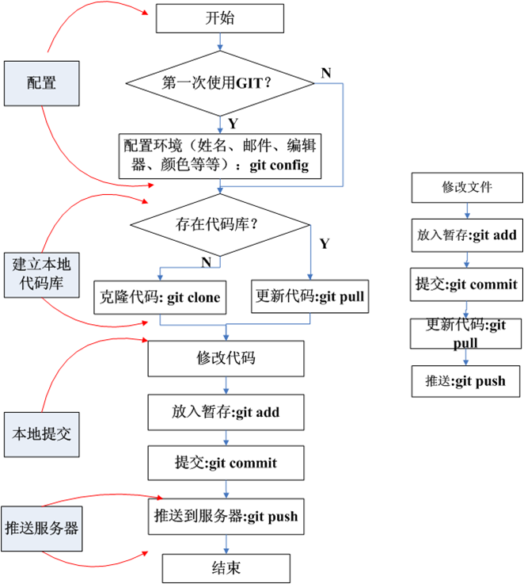
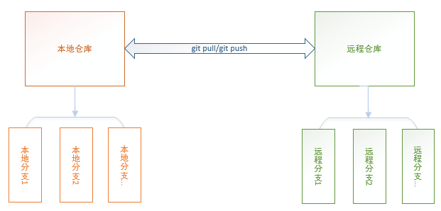
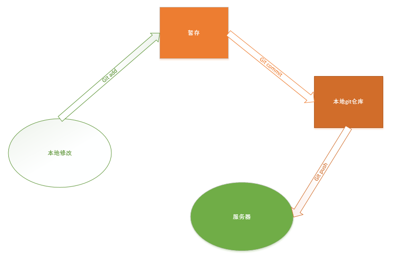

### 1. git安装
### 2. git配置
* 用户信息\
  `git config --global user.name "fanzhang"`\
  `git config --global user.email "fanzhang@yunnex.com"`
* 文本编辑器\
  `git config --global core.editor notepad`
* 查看配置信息\
  `git config --list`
* 配置git注释模板\
 `git config –global commit.template ./commit_template`
* Git SSH配置\
  `ssh-keygen -t rsa -C "fanzhang@yunnex.com"`
### 3. git使用流程
 
### 4. 本地代码与服务器代码的关系

### 5. git提交代码流程

### 6. git常用命令
1. 取代码
    * 第一次取代码\
    `git clone git@github.com:fanzhangvip/GitProject.git`
    * 再次取\
      `git pull <分支>`\
      冲突`git checkout   <冲突文件>`
2. git代码提交命令\
    `git add <修改文件>`\
    `git commit /git commit –a(慎用)`\
    `git push  [分支]可选`\
    另:
      ```
      git diff ,git diff --cached
      git reset  HEAD <文件路径>,git commit –amend,
      git reset --HARD <hashcode>
      ```
3. 分支的相关命令
    ```
    git branch –a  查看服务器分支
    git branch        查看本地分支
    git checkout <服务器分支>  -b  <本地分支>
    建立本地分支，并切换到对应的分支
    git checkout <分支 >    本地已存在分支切换，主分支 master
    git branch –D  <分支名>  删除本地分支
    git push/pull origin <分支名>  推送和拉代码
    git cherry –pick <hashcode>  将另一分支的提交合入到本分支
    ```
4. 其他常用命令
    